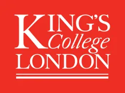

## About

This meeting aims to bring together statisticians from across different faculties at King's College London.

The workshop is co-organised by Dr Vasiliki Koutra, Prof Richard Emsley, Prof Daniel Stahl, and Dr Lauren Bell. 

The meeting is an opportunity to share current statistical work and applications, and identify common interests to help shape follow-up interactions.

## Location

```{r}
#| fig.align: "center"
#| message: false
#| warning: false
library(leaflet)
leaflet() |>
  addTiles() |>
  setView(
    lat = 51.505595951794255, 
    lng = -0.11230186368966893,
    zoom = 16) |>
  addMarkers(
    lat = 51.505595951794255, 
    lng = -0.11230186368966893,
    popup = paste0(
  '<b>Franklin Wilkins Building</b><br>',
  '<a href="https://www.google.com/maps/dir/?api=1&destination=Franklin+Wilkins+Building+Kings+College+London" target="_blank">',
  'Get directions</a>')
)
```

The workshop will be held in the [Franklin-Wilkins building](https://www.kcl.ac.uk/visit/franklin-wilkins-building) on the [Waterloo Campus](https://www.kcl.ac.uk/visit/waterloo-campus). The main entrance is on [Stamford Street](https://www.kcl.ac.uk/assets/pdf24/waterloo-detail-map-2025.pdf).

All scientific sessions are in Room FWB 1.60. Check-in, coffee, lunch and tea are in the Glass Suites.

## Programme


```{r}
#| message: false
#| warning: false
library(gt)
library(readr)
library(janitor)
library(dplyr)

prog <- read_csv("data/schedule.csv", 
                 col_types = cols(.default = col_character()))
prog <- clean_names(prog)
```

```{r}
prog |> 
  gt(groupname_col = "session") |>
  sub_missing(
    missing_text = ""
    ) |>
  tab_options(
    table.width = pct(100),
    table.align = "left",
    column_labels.hidden = TRUE
    ) |>
  cols_width(
    speaker ~ pct(30),
    title ~ pct(70)
  ) |>
  tab_style(
  style = list(
    cell_fill(color = "lightgrey")
  ),
  locations = cells_row_groups()
) |>
  text_transform(
    locations = cells_row_groups(),
    fn = function(x) {
      lapply(x, function(x) {
        x <- strsplit(x, split = " (", fixed = T)[[1]]
        if(length(x) > 1) {
          gt::md(paste0("**", x[[1]], "**", " (", x[[2]]))
        } else {
          gt::md(paste0("**", x[[1]], "**"))
        }
      })
    }
  )
```

## Sponsors

{width=25% fig-align="center"}


