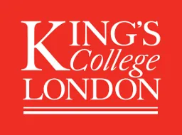

## About

This meeting aims to bring together statisticians from across different faculties at King's College London to share current research and applications, exchange ideas, and explore common interests and opportunities for Interdisciplinary collaborations.

It is co-organised by Dr Vasiliki Koutra, Prof Richard Emsley, Prof Daniel Stahl, and Dr Lauren Bell and it forms part of King's Statistics; an initiative to connect and strenghten the University's statistical community, raise its profile, and turn shared expertise into new opportunities for research, training, external partnerships and funding.

## Location

```{r}
#| fig.align: "center"
#| message: false
#| warning: false
library(leaflet)
leaflet() |>
  addTiles() |>
  setView(
    lat = 51.51152294740334,  
    lng = -0.11629362859734484,
    zoom = 16) |>
  addMarkers(
    lat = 51.51152294740334,  
    lng = -0.11629362859734484,
    popup = "<a href = \"https://www.google.com/maps/dir/?api=1&destination=51.51195839821278,-0.11659050419246998\">Directions to the Strand Campus</a>"
  )
```

The workshop will be held in the [Council Room](https://www.kcl.ac.uk/kingsvenues/rooms/strand-council-room) of the [King's Building](https://www.kcl.ac.uk/visit/kings-building) on the [Strand Campus](https://www.kcl.ac.uk/visit/strand-campus). The main entrance is via the [Strand Building](https://www.kcl.ac.uk/visit/strand-building).


## Programme

```{r}
#| message: false
#| warning: false
library(gt)
library(readr)
library(janitor)
library(dplyr)

prog <- read_csv("data/schedule_sept-2026.csv", 
                 col_types = cols(.default = col_character()))
prog <- clean_names(prog)
```

```{r}
prog |> 
  gt(groupname_col = "session") |>
  sub_missing(
    missing_text = ""
    ) |>
  tab_options(
    table.width = pct(100),
    table.align = "left",
    column_labels.hidden = TRUE
    ) |>
  cols_width(
    speaker ~ pct(30),
    title ~ pct(70)
  ) |>
  tab_style(
  style = list(
    cell_fill(color = "lightgrey")
  ),
  locations = cells_row_groups()
) |>
  text_transform(
    locations = cells_row_groups(),
    fn = function(x) {
      lapply(x, function(x) {
        x <- strsplit(x, split = " (", fixed = T)[[1]]
        if(length(x) > 1) {
          gt::md(paste0("**", x[[1]], "**", " (", x[[2]]))
        } else {
          gt::md(paste0("**", x[[1]], "**"))
        }
      })
    }
  )
```

## Previous meetings

[18 March 2026](march-2026.html)


## Sponsors

{width="25%" fig-align="center"}
